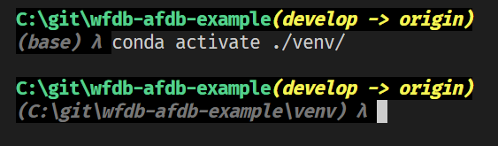

# 虚拟环境配置

本项目使用 miniconda 在 `venv` 目录下建立虚拟环境

- python 3.10.9

使用的核心 packages 如下:

- numpy 1.24.2
- matplotlib 3.7.0 用于绘图
- pandas 用于读 csv
- scipy 1.10.1 主要使用信号处理的部分
- scikit-learn 1.2.1 主要使用分类器和评价的部分
- wfdb 4.1.0 读数据

其他 packages 包括:

- ipykernel 在 VS Code 中运行 jupyter notebook
- pre-commit 3.1.1 自动格式化

初次使用时可以使用如下语句建立虚拟环境：

```bash
conda create -p ./venv/ -c conda-forge python=3.10 wfdb scipy scikit-learn matplotlib
```

创建完成后，请确认编辑器 (如 VS Code) 识别并切换到该虚拟环境。


或在手动运行 python 命令时，使用如下命令激活虚拟环境：

```bash
conda activate ./venv/
```



## 下载 afdb

使用 wfdb 下载 afdb 到本地目录，可以使用 `scripts/download.py` 脚本，如下所示：

```cmd
C:\git\wfdb-afdb-example(develop -> origin)
(C:\git\wfdb-afdb-example\venv) λ python scripts\download.py
Generating record list for: 00735
Generating record list for: 03665
Generating record list for: 04015
Generating record list for: 04043
Generating record list for: 04048
Generating record list for: 06453
Generating record list for: 06995
Generating record list for: 07162
Generating record list for: 07859
Generating record list for: 07879
Generating record list for: 07910
Generating record list for: 08215
Generating record list for: 08219
Generating record list for: 08378
Generating record list for: 08405
Generating record list for: 08434
Generating record list for: 08455
Generating list of all files for: 00735
Generating list of all files for: 03665
Generating list of all files for: 04015
Generating list of all files for: 04043
Generating list of all files for: 04048
Generating list of all files for: 04126
Generating list of all files for: 04746
Generating list of all files for: 04908
Generating list of all files for: 04936
Generating list of all files for: 05091
Generating list of all files for: 05121
Generating list of all files for: 05261
Generating list of all files for: 06426
Generating list of all files for: 06453
Generating list of all files for: 06995
Generating list of all files for: 07162
Generating list of all files for: 07859
Generating list of all files for: 07879
Generating list of all files for: 07910
Generating list of all files for: 08215
Generating list of all files for: 08219
Generating list of all files for: 08378
Generating list of all files for: 08405
Generating list of all files for: 08434
Generating list of all files for: 08455
Created local base download directory: ./data/afdb/
Downloading files...
Finished downloading files
```
